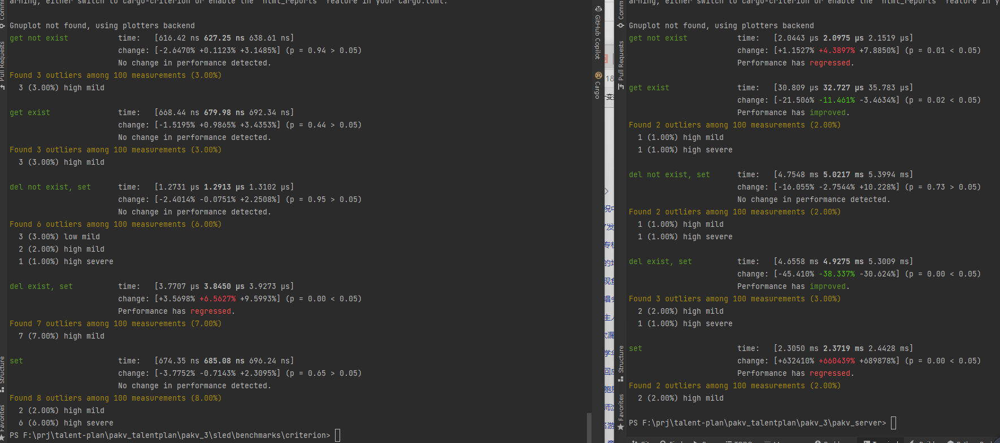

1. 1.单线程短链接tcp

   [Building a Single-Threaded Web Server - The Rust Programming Language (rust-lang.org)](https://doc.rust-lang.org/book/ch20-01-single-threaded.html)

   协议就先简单点好了，直接吧命令发过去，返回也直接返回消息，开头用f: s:标注是否成功

   基本很快就换完了

2. logging

   主要作用是将一些错误调试信息更加结构化输出，便于开发时寻找漏洞，同时可以配置log级别来选择log内容

3. benchmark 对比sled

   benchmark是比较重要但我未曾实践过的环节，只有测验性能才能知道自己代码真正的效率

   对比来看，写操作特别慢，因为这里每次写都要重新打开文件

   

4. ~~可插拔（可替换引擎）~~

   这里考虑到后面要引入async，但trait不支持零开销async，所以暂时不考虑用trait

