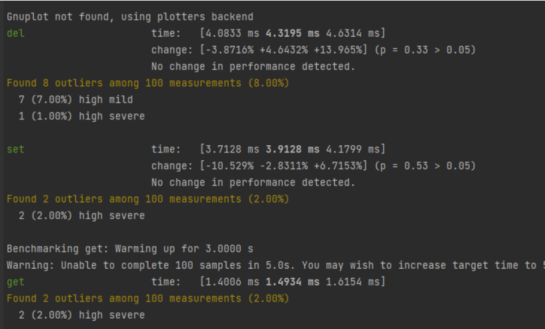
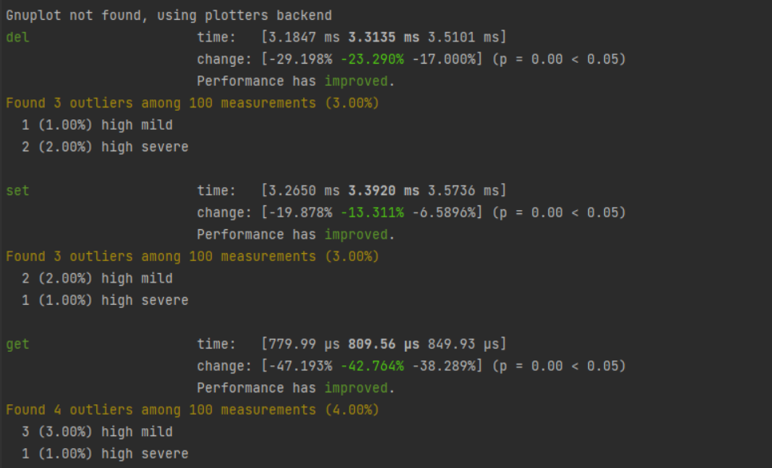
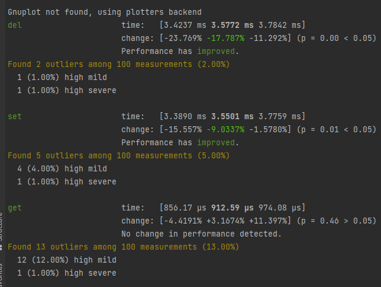

### pakv Project 4: Concurrency and parallelism

**Task**: Create a multithreaded, persistent key/value store server and client
with synchronous networking over a custom protocol.

**Goals**:

- x Write a simple thread pool
- x Use channels for cross-thread communication
- (只用了通道) Share data structures with locks
- x Perform read operations without locks
- Benchmark single-threaded vs multithreaded

**Topics**: thread pools, channels, locks, lock-free data structures,
  atomics, parameterized benchmarking.

## Introduction

In this project you will create a simple key/value server and client that
communicate over a custom protocol. The server will use synchronous networking,
and will respond to multiple requests using increasingly sophisticated
concurrent implementations. The in-memory index will become a concurrent
data structure, shared by all threads, and compaction will be done on a
dedicated thread, to reduce latency of individual requests.

### 记录

分析：客户端连入后，

服务端阻塞获取客户进程（此处为一个阻塞io）同步，长时间占用一个主线程

​	线程池一个线程时，只有一个线程阻塞处理用户链接，上一个链接结束后，下一个才开始（我理解的题意中的单线程）

​	线程池四个线程时，同一时间可以阻塞三个用户，那么相对来说比两个线程

更优：非阻塞，系统调用触发后。先去处理别的，

使用通道，rust通道为mpsc，多个线程需要从同一个通道取得task的话，需要上锁，‘

  此处采用crossbeam的mpmc通道

这是四个线程的情况，主要看get操作（get在本地的速度比较快，主要为网络io

切换到两个线程（出乎意料的是两个线程反而更快

一个线程略慢于两个线程

分析，由于这里线程池的实现没有做异步调度，遇到网络io为阻塞行为，耗时都较大。差距主要来自，线程的竞争情况，

  线程多时，从队列竞争取出，反而使性能下降