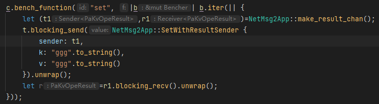
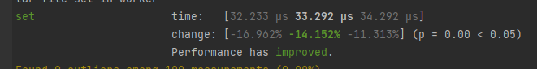
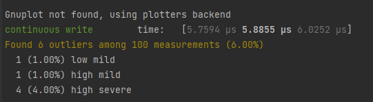

# pakv Project5: Asynchrony

**Task**: Create a multi-threaded, persistent key/value store server and client with *asynchronous* networking over a custom protocol.

**Goals**:

- x Understand the patterns used when writing Rust futures
- Understand error handling with futures
- Learn to debug the type system
- x Perform asynchronous networking with the tokio runtime
- Use boxed futures to handle difficult type-system problems
- Use `impl Trait` to create anonymous `Future` types

**Topics**: asynchrony, futures, tokio, `impl Trait`.

## Records

这一块主要要引入tokio，tokio对io操作进行了类似于go的调度优化，最大化发挥io性能。

1. 封装服务端客户端，tcp数据处理（粘包半包）

2. 一开始准备吧内核也换成tokio的api，后来发现tokio issue处指出 tokio异步api不如线程阻塞写的性能，所以采用spawn_blocking来维护 文件写入worker。 

   [Benchmarking Tokio Tasks and Goroutines : rust (reddit.com)](https://www.reddit.com/r/rust/comments/lg0a7b/benchmarking_tokio_tasks_and_goroutines/)

   

   关于spawn_blocking的解释，tokio的异步基于await调度，如果执行阻塞函数则会阻塞tokio的调度，所以要将阻塞程序放在spawn_blocking中。

3. 下一步，先测试将写入任务集中到等待任务的worker线程后写入的性能

   

   

   与sled的ns级别还是有差距，先测测看直接文件顺序写。

   

   以上是纯纯的连续写，发现通道通信还是消耗掉不少时间的，毕竟通道是为并发情况设计的，而这里的bench是顺序操作，不存在并发，所以没法反应并发情况下的状态

4. 需要明确一个我目前的疑问，数据库是缓存到内存中就当成功还是确保写入硬盘后成功，

   经过一波查询了解后发现，大部分情况，都是wal模式，即log得保证落盘；postgre这种，会提供一个fsync可选参数，默认也是on的。

5. 需要寻找一个并发式的测试方案，才能发挥tokio异步的效果，

   

