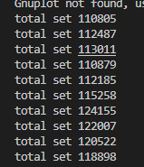

# pakv Project5: Asynchrony

**Task**: Create a multi-threaded, persistent key/value store server and client with *asynchronous* networking over a custom protocol.

**Goals**:

- x Understand the patterns used when writing Rust futures
- Understand error handling with futures
- Learn to debug the type system
- x Perform asynchronous networking with the tokio runtime
- Use boxed futures to handle difficult type-system problems
- Use `impl Trait` to create anonymous `Future` types

**Topics**: asynchrony, futures, tokio, `impl Trait`.

## 运行流程

- 客户端

  - 与服务端建立长连接，通过tokiospawn两个读写循环，处理接受的数据和往外发出数据
    - 创建两个通道，一个用与应用层往服务端发数据的通道，另一个用于服务端数据，发给应用层处理的通道
    - 接收循环中对接收数据进行粘包和半包的处理，帧头描述数据包长度，接受完整通过通道发给应用
  - 应用处通过select读取来自服务端的消息和用户输入消息，
    - 读取到用户输入一行，就打包发给服务端
    - 读取到服务端回应，就输出给用户

- 服务端

  - spawn一个task用于循环监听客户端，监听到一个客户端就spawn两个读写循环，处理接收数据和往外发出数据

    - 建立一个连接后，分配一个客户端id，向主循环发送一个ClientIn的消息
    - 断开连接，向主循环发送clientout的消息

  - 主循环通过select等待来自网络的消息和内部写入线程的消息，同时启动一个worker线程，进行写入任务的执行

    - 写入线程

      - 操作命令，进行log的增加
      - 初始化加载tarfileid，确定目标吸入文件

    - 网络消息

      - clientIn

        传入clienid和向client发送消息的sender，后续接收到命令后，通过clientid获取到sender，来向客户端发送执行结果

      - clientout

        移除无效的client

      - 执行命令（set，get，del）

        携带clientid，并分配一个opeid，若有写入操作的，则将opeid传入写入线程

    - 写入线程消息

      - 写入结束，传回对应的opeid

        执行写入之后的操作（存入内存上下文

        根据opeid找到对应的clientsender，将结果发回客户端

## 注意点

采用了tokio的通道模式进行网络消息，写入线程的通信，但经过测试发现总体性能不是很好，通道开销比较大

tokio应当单独作为网络部分的处理，而文件写入部分使用锁和原生线程进行处理

## Records

这一块主要要引入tokio，tokio对网络io操作进行了类似于go的调度优化，最大化发挥网络io并发性能。

1. 封装服务端客户端，tcp数据处理（粘包半包）

2. 一开始准备吧内核也换成tokio的api，后来发现tokio issue处指出 tokio异步api不如线程阻塞写的性能，所以采用spawn_blocking来维护 文件写入worker。 

   [Benchmarking Tokio Tasks and Goroutines : rust (reddit.com)](https://www.reddit.com/r/rust/comments/lg0a7b/benchmarking_tokio_tasks_and_goroutines/)

   

   关于spawn_blocking的解释，tokio的异步基于await调度，如果执行阻塞函数则会阻塞tokio的调度，所以要将阻塞程序放在spawn_blocking中。

3. 下一步，先测试将写入任务集中到等待任务的worker线程后写入的性能

   

   

   与sled的ns级别还是有差距，先测测看直接文件顺序写。

   

   以上是纯纯的连续写，发现通道通信还是消耗掉不少时间的，毕竟通道是为并发情况设计的，而这里的bench是顺序操作，不存在并发，所以没法反应并发情况下的状态

4. 需要明确一个我目前的疑问，数据库是缓存到内存中就当成功还是确保写入硬盘后成功，

   经过一波查询了解后发现，大部分情况，都是wal模式，即log得保证落盘；postgre这种，会提供一个fsync可选参数，默认也是on的。也发现sled默认式500ms fsync，而不是及时flush

   给sled加上flush后，一次操作也需要12us

   

5. 测试一下spawn多个task请求进行set

   ```rust
   static TOTAL: AtomicUsize = AtomicUsize::new(0);
   
   pub fn conccurent_bench(){
       let (t, r)=tokio::sync::mpsc::channel(10);
       tokio::spawn(async move{
           server_app::PaKVServerApp::new().await
               .hold(r).await;
       });
       std::thread::sleep(std::time::Duration::from_secs(10));
       //创建多个task，进行set并等待结果，看一秒内，有多少个成功收到结果
       for _i in 0..10{
           let t = t.clone();
           tokio::spawn(async move {
               loop {
                   let (t1, r1) =
                       NetMsg2App::make_result_chan();
                   t.send(NetMsg2App::SetWithResultSender {
                       sender: t1,
                       k: "ggg".to_string(),
                       v: "ggg".to_string()
                   }).await.unwrap();
                   let _r = r1.await.unwrap();
                   TOTAL.fetch_add(1, Ordering::Release);//内存屏障，防止乱序优化
               }
           });
       }
       let mut vlast=0;
       for _i in 0..10{
           std::thread::sleep(std::time::Duration::from_secs(1));
           let v=TOTAL.load(Ordering::Relaxed);
           println!("total set {}",v-vlast);
           vlast=v;
       }
   }
   ```
   
   测试sled flush之后的并发性能
   
   ```rust
   {
       //创建多个task，进行set并等待结果，看一秒内，有多少个成功收到结果
       for _i in 0..10{
       let db=db.clone();
       std::thread::spawn(move || {
           let mut count=0;
           loop {
               db.insert("kskskskk".as_bytes(),format!("v{}",count)).unwrap();
               db.flush();
               TOTAL.fetch_add(1, Ordering::Release);//内存屏障，防止乱序优化
               count+=1;
               }
           });
       }
       let mut vlast=0;
       for _i in 0..10{
           std::thread::sleep(std::time::Duration::from_secs(1));
           let v=TOTAL.load(Ordering::Relaxed);
           println!("total set {}",v-vlast);
           vlast=v;
       }
   }
   ```
   
   与上面一样的逻辑(左边sled，右边pakv)，可以发现并发下，两者的性能差不多
   
   
   
   减少并发线程数后发现，sled再2-3个线程下，性能最好
   
   

